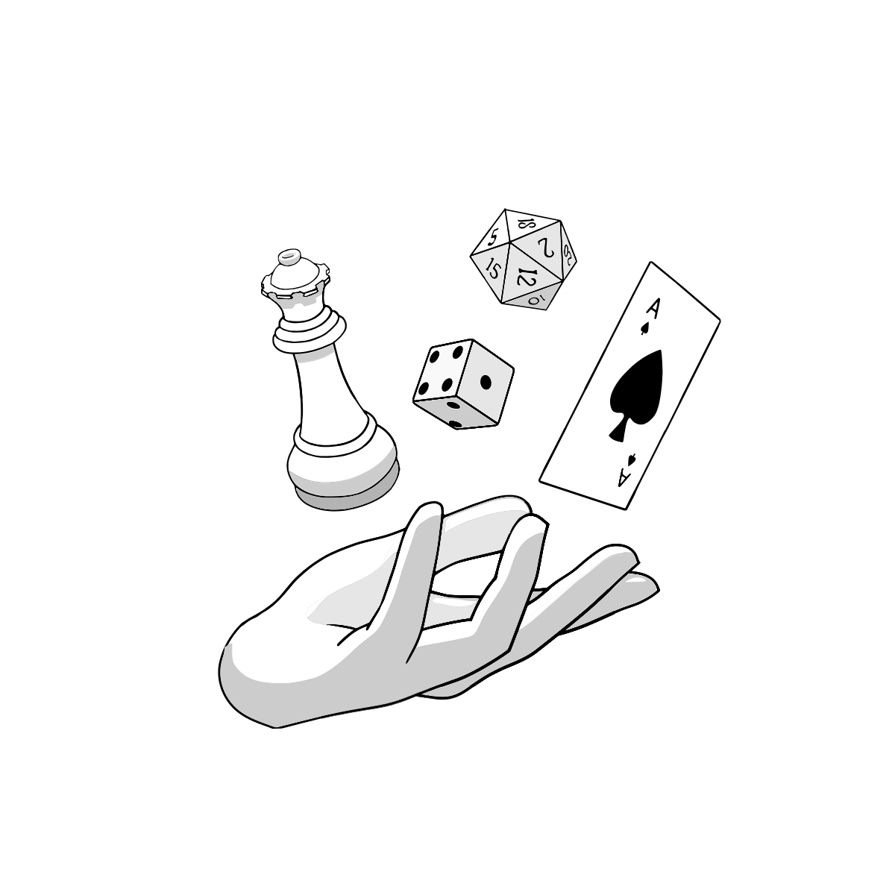

# Abso'Ludique site Web 

## Description du projet

Site web du club Abso'Ludique (jeux de société) à TELECOM Nancy

## Back-end
### Installation
Dans le répertoire back du projet, veuillez exécuter les commandes suivantes pour installer les dépendances :
```bash
python3 -m venv venv
source venv/bin/activate
pip install -r requirements.txt
```

### Lancement
Après avoir installé le projet, vous pouvez le lancer en utilisant
```bash
cd back
source venv/bin/activate
python3 app.py
```

### Lancement des tests
Dans le répertoire back du projet :
```bash
cd back
source venv/bin/activate
pytest
```

### Mise à jour des dépendances
```bash
cd back
source venv/bin/activate
pip freeze > requirements.txt
```

## Front-End

### Installation
Dans le répertoire front du projet, veuillez exécuter les commandes suivantes pour installer les dépendances :
```bash
cd front
npm install
```

### Lancement
Après avoir installé le projet, vous pouvez le lancer en utilisant
```bash
cd front
npm run dev
# or
npm run build
# or 
npm start
```
